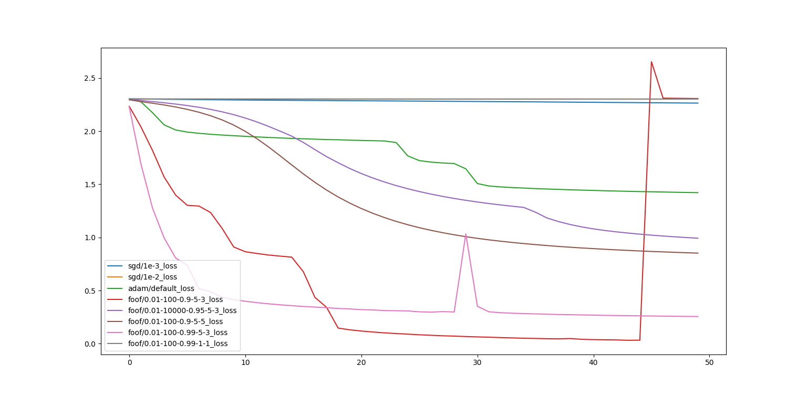
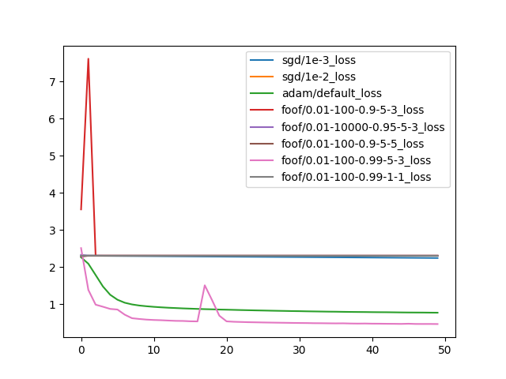

# 实验环境
| package | version |
| :-----: | :-----: |
| Python | 3.9.1 |
| cuda(optional) | 11.6 |
| pytorch | 1.12.1 |
| pyQt(alternative) | |

pyQt作为pyplot的后端绘图库，可以根据实际情况自行替换为其他后端库。
# 数据集
MNIST手写数字数据集，torch中内置。
# 运行方式
python fullfoof.py
# 实验结果
  
